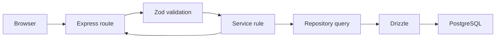

# Exploring the RackChief backend

RackChief is an Express and TypeScript API backed by PostgreSQL. Drizzle describes tables and builds queries. Zod validates requests and supplies the generated OpenAPI document. Better Auth owns passwords and browser sessions. MCP is optional and uses separate RackChief bearer tokens.

`src/config/database-url.ts` builds the PostgreSQL URL from `PG_USER`, `PG_PASS`, `PG_HOST`, `PG_DB_NAME`, and optional port/TLS settings. The same builder is used by runtime queries and the Drizzle CLI. Docker testing uses `PG_HOST=db`; an external deployment uses its database host.

## Startup and sign-in

`src/server.ts` opens a listener for startup polling, applies migrations, and builds the optional catalog index. Until it marks startup ready, database-backed routes return 503. `GET /startup/status` reports the phase; `GET /health` returns 200 only when ready and PostgreSQL responds. A missing catalog is allowed: custom inventory still works. Migration failure closes the listener.

On an empty database, `GET /api/v1/setup/status` returns `{ "setupRequired": true }`. `POST /api/v1/setup/admin` creates the initial administrator. After that, public registration is blocked. Use Better Auth's `/api/auth/sign-in/email` endpoint to sign in; browser requests to `/api/v1` send the HttpOnly session cookie with credentials. `src/auth/middleware.ts` protects ordinary REST routes. `/mcp` is separate: it stays disabled unless enabled by an authenticated administrator and uses its own bearer token.

## Where to look

| Directory | What it contains |
| --- | --- |
| `src/app.ts`, `src/server.ts` | Route mounting, middleware, startup and health. |
| `src/modules/<feature>/*.routes.ts` | URLs, request parsing, response codes. |
| `src/modules/<feature>/*.schema.ts` | Zod input and response shapes. |
| `src/modules/<feature>/*.service.ts` | Business rules and decisions. |
| `src/modules/<feature>/*.repository.ts` | Drizzle queries and transactions. |
| `src/db/schema/*.ts`, `drizzle/*.sql` | Table definitions and applied migration history. |
| `src/modules/<feature>/*.openapi.ts`, `src/openapi/index.ts` | Published API contract at `/openapi.json`. |
| `src/auth`, `src/mcp` | Browser session and separate MCP authentication. |



A route should parse and send HTTP data; a service checks rules such as rack overlap; a repository reads or writes tables. Database constraints remain the final defense for keys and foreign references. To trace a behavior, start at the route and follow the named service and repository. For example, `rack.routes.ts` calls `rack.service.ts`, which calls `rack.repository.ts`.

## Three requests to try

These examples assume a valid Better Auth session cookie. Substitute IDs returned by your own development instance. Dates in responses are ISO strings; nullable fields may be `null`.

Create an asset using an existing asset type ID:

```http
POST /api/v1/assets
Content-Type: application/json
Cookie: better-auth.session_token=<session>

{"name":"Lab switch","assetTypeId":"11111111-1111-4111-8111-111111111111","status":"active","rackUnits":1}
```

The 201 response includes an assigned `id`, name, status, rackUnits, nullable inventory fields, timestamps, and an `assetType` summary. `asset.routes.ts` validates input; `asset.service.ts` checks the optional location and archive state; `asset.repository.ts` inserts the row.

Read the joined detail for that ID:

```http
GET /api/v1/assets/22222222-2222-4222-8222-222222222222/detail
Cookie: better-auth.session_token=<session>
```

The 200 response extends the asset with `location`, `rackPlacements`, `components`, `interfaces` (each with `ipAddresses`), `ports`, and `relationships`. `asset-detail.service.ts` gathers these from existing modules; empty collections are arrays.

Update one project work or purchase item:

```http
PATCH /api/v1/projects/33333333-3333-4333-8333-333333333333/items/44444444-4444-4444-8444-444444444444
Content-Type: application/json
Cookie: better-auth.session_token=<session>

{"status":"in_progress","notes":"Cabling started"}
```

The 200 response is the updated item, with its `projectId`, type, title, status, nullable dates and costs, sort order, and timestamps. `project.routes.ts` validates the patch; `project.service.ts` converts date strings; `project.repository.ts` updates only the item belonging to the URL's project. A missing item in that project returns 404.

For a full list of actual inputs, outputs, and status codes, open `/docs` or `/openapi.json` on a running backend. Read `docs/backend-v1-status.md` before treating this checkout as a stable release.
